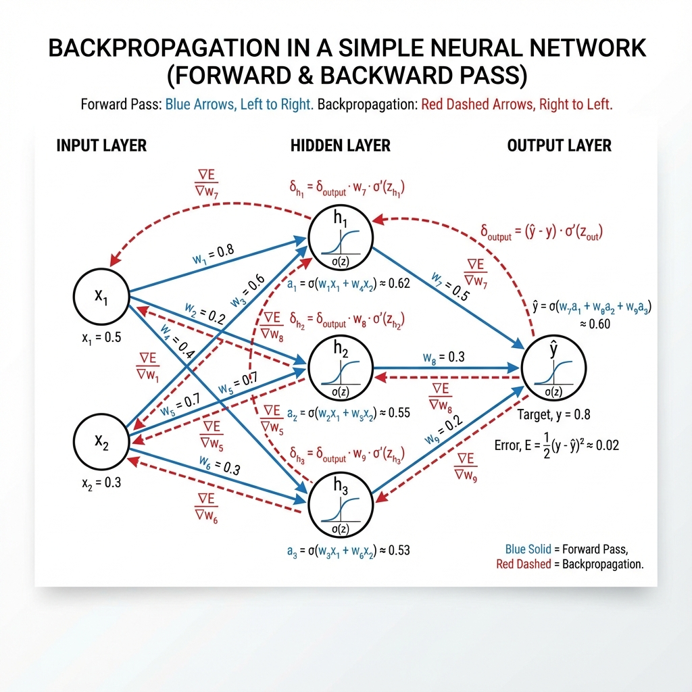
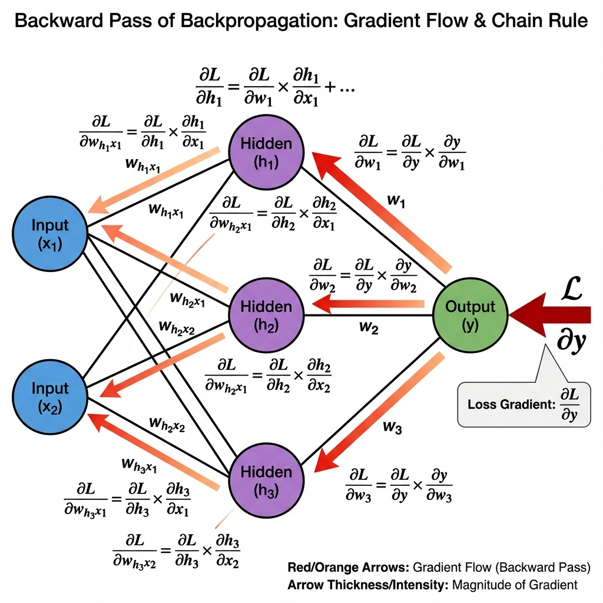
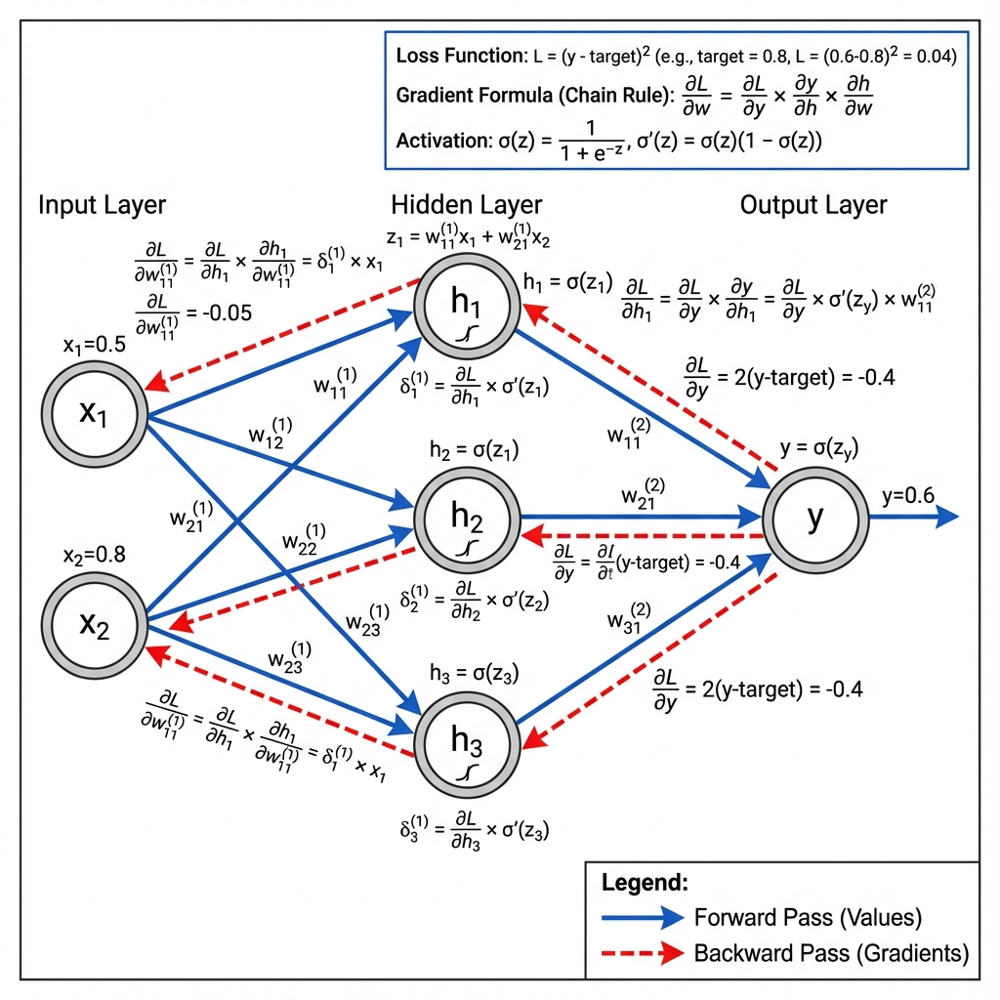
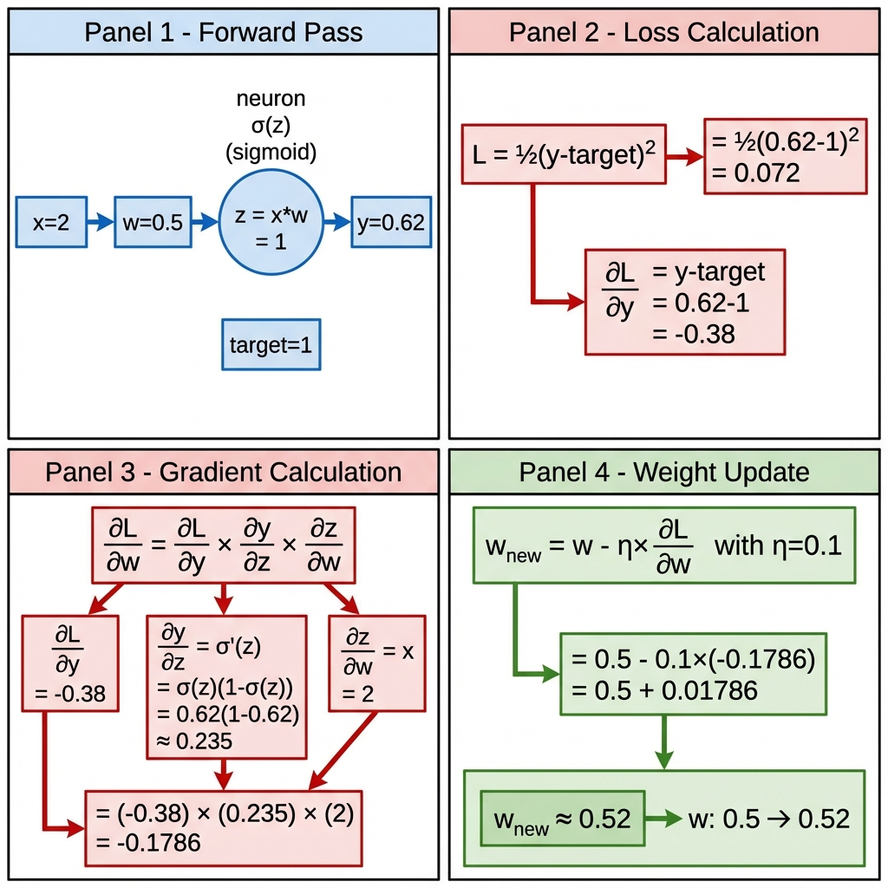

# Deep Learning, Neural Networks, and PyTorch

This repository contains a collection of notes, Python models, and Jupyter notebooks related to deep learning and neural networks.

Repository is created for the purpose of revising, learning and understanding deep learning concepts with available resources in the recent years.

The codes are planned for all types of learners, from beginners to advanced learners.

### Deep Learning and Neural Networks

**Neural Networks** are a set of algorithms, modeled loosely after the human brain, that are designed to recognize patterns. They interpret sensory data through a kind of machine perception, labeling or clustering raw input. The patterns they recognize are numerical, contained in vectors, into which all real-world data, be it images, sound, text or time series, must be translated.

**Deep Learning** is a subfield of machine learning concerned with algorithms inspired by the structure and function of the brain called artificial neural networks. Deep learning is a type of neural network with many layers (hence "deep"). These deep neural networks are capable of learning complex patterns and representations from large amounts of data.

### PyTorch

**PyTorch** is a popular open-source machine learning library based on the Torch library, used for applications such as computer vision and natural language processing. 

It is primarily developed by Facebook's AI Research lab (FAIR). 

It is known for its flexibility and ease of use, especially in research and development.

You can find more information and get started with PyTorch on their official website: [pytorch.org](https://pytorch.org/)

## Backpropagation

**Backpropagation** (backward propagation of errors) is the fundamental algorithm used to train neural networks. It efficiently computes gradients of the loss function with respect to the network's weights using the chain rule of calculus. These gradients are then used to update the weights and minimize the loss.

### How Backpropagation Works

The backpropagation algorithm consists of two main phases:

1. **Forward Pass**: Input data flows through the network layer by layer, computing activations and producing a prediction.
2. **Backward Pass**: The error (difference between prediction and target) propagates backward through the network, computing gradients for each weight using the chain rule.

### Visual Explanations

#### 1. Forward Pass


The forward pass shows how input values (x₁, x₂) flow through the network from left to right. Each connection has a weight (w), and each neuron applies an activation function (typically sigmoid, ReLU, etc.) to produce outputs that become inputs for the next layer.

#### 2. Backward Pass (Gradient Flow)


The backward pass demonstrates how gradients flow from right to left, starting from the loss function. Using the chain rule, we compute ∂L/∂w for each weight, showing how much each weight contributed to the error. Gradients guide weight updates to minimize the loss.

#### 3. Complete Backpropagation Flow


This comprehensive diagram shows both forward (blue arrows) and backward (red arrows) passes simultaneously. It illustrates how the forward pass computes predictions while the backward pass computes gradients, with mathematical notation showing the chain rule in action: ∂L/∂w = ∂L/∂y × ∂y/∂h × ∂h/∂w.

#### 4. Step-by-Step Calculation


This detailed breakdown shows the complete backpropagation process with numerical examples:
- **Panel 1**: Forward pass computation with actual values
- **Panel 2**: Loss calculation and its derivative
- **Panel 3**: Gradient computation using the chain rule
- **Panel 4**: Weight update using gradient descent (w_new = w - η×∂L/∂w)

### Key Concepts

- **Chain Rule**: Backpropagation applies the chain rule to compute how changes in weights affect the final loss
- **Gradient Descent**: Weights are updated in the direction that reduces the loss: w = w - learning_rate × gradient
- **Vanishing/Exploding Gradients**: In deep networks, gradients can become very small (vanishing) or very large (exploding) as they propagate backward

## Folder Structure

*   **`data/`**: This directory contains various datasets used for training and testing deep learning models. Will get updated as I get new datasets or play with new datasets.
*   **`notes/`**: This directory contains various notes, research papers, and theoretical explanations related to deep learning concepts.
*   **`pyModels/`**: This directory houses Python scripts and modules implementing different deep learning models and architectures.

## Visualizations:  
I have included various visualizations in the repository to help you understand the data and the models better.
- Class distribution plots
- Feature histograms by class
- Correlation heatmap
- Pairplot matrix
- Before/after scaling comparison
- Training loss & accuracy curves
- Confusion matrices (counts & percentages)
- PCA-projected decision boundaries
- Prediction confidence distributions
- Individual prediction probability bars

## Getting Started

To get started with this repository, you will need to:

1.  Clone the repository:
    ```bash
    git clone https://github.com/anishchapagain/deep-learning.git
    ```
2.  Navigate to the project directory:
    ```bash
    cd deep-learning
    ```
3.  Install the necessary dependencies. It is recommended to use a virtual environment:
    ```bash
    python -m venv venv
    source venv/bin/activate  # On Windows, use `venv\Scripts\activate`
    pip install -r requirements.txt # Assuming you have a requirements.txt file
    ```
## Common Python Modules used are:
- `numpy`
- `pandas`
- `matplotlib`
- `seaborn`
- `scikit-learn`
- `pytorch`
- `torchvision`
- `torchtext`
- `torchmetrics`
- `torchsummary`
- `torchvision`
- `torchtext`
- `torchmetrics`
- `torchsummary`

## Notes
*   `notes/` content are experimental contents that has been updated and fixed on study sources to generate easy contents for better understanding using, reformatting and editing using `GenAI`.

## Contributing

Contributions are welcome! If you have any suggestions, improvements, or new models to add, please feel free to open an issue or submit a pull request.
