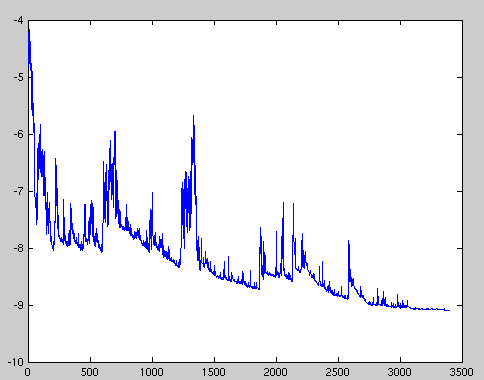

# Gradient Descent for Neural Networks

Gradient descent algorithm, a cornerstone of training neural networks and other machine learning models.

---

## 1. Introduction to Gradient Descent

In machine learning, **training a model** means finding the optimal set of parameters (weights and biases) that minimizes a **loss function**. The loss function measures how far the model's predictions are from the actual target values.

**Gradient Descent** is an iterative optimization algorithm used to find this minimum. It is the most common method for training neural networks.

**The Core Idea: The Mountain Analogy**

Imagine you are standing on a foggy mountain and want to get to the lowest point in the valley. You can't see the whole landscape, but you can feel the slope of the ground where you are standing. To get to the bottom, you would take a step in the steepest downhill direction. You would repeat this process, always moving downhill, until you reach a point where the ground is flat.

This is exactly what Gradient Descent does:
- **The Mountain:** The "loss landscape" of your model.
- **Your Position:** The current set of weights and biases.
- **The Lowest Point:** The optimal set of weights that minimizes the loss.
- **The Steepest Downhill Direction:** The negative of the gradient.

### A Quick Calculus Refresher
To understand gradient descent, it helps to remember two key concepts from calculus:

- **What is a Derivative?** For a function with one variable, the derivative is simply the **slope** of the function at a given point. It tells us the direction and steepness of the function.
    - A **positive derivative** means the function is increasing (going up).
    - A **negative derivative** means the function is decreasing (going down).
    - A **zero derivative** indicates a flat point. This is the crucial signal gradient descent looks for. When the gradient is zero, the update step becomes zero (`w_new = w_old - η * 0`), and the algorithm **stops**. The goal is to stop at the global minimum (the lowest point in the entire landscape), but the algorithm will also stop at a local minimum (the bottom of a small valley) or a saddle point.

- **What is a Gradient?** The gradient is a generalization of the derivative for functions with many variables (like a neural network's loss function). It's a **vector** of all the partial derivatives of the function. This vector always points in the direction of the **steepest ascent**.

By calculating the gradient, we know which way is "uphill." To find the minimum, we simply take a step in the exact opposite direction.

#### Implications in Deep Learning
In deep networks, gradients are calculated via the chain rule, meaning they are multiplied back through many layers. This leads to two common problems:

- **Vanishing Gradients:** If the derivatives are consistently small (between 0 and 1), their product can shrink exponentially, becoming almost zero. This means the early layers of the network get almost no gradient signal and stop learning.
- **Exploding Gradients:** If the derivatives are consistently large (e.g., > 1), their product can grow exponentially. This leads to massive, unstable weight updates that cause the model to fail.

- **Non-Zero-Centered Activations:** If an activation function (like sigmoid) only outputs positive values, the gradient for the weights in that layer will always have the same sign (all positive or all negative). This forces the weight updates to follow an inefficient, zig-zagging path, slowing down convergence. Using zero-centered activations (like tanh) can help resolve this.


---

## 2. Core Concepts

### The Loss Function
Before the model can learn, we need to quantify its error. The **loss function** (or cost function) does this by comparing the model's predictions to the true values and outputting a single number, the **loss**. The goal of training is to minimize this loss.

### The Gradient: The Compass for Learning
The **gradient** is a vector of partial derivatives that points in the direction of the **steepest ascent** of the loss function. To minimize the loss, we must move in the **opposite direction** of the gradient.

For a loss function `L` with parameters `w`, the gradient is denoted as `∇L`.

---

## 3. The Gradient Descent Algorithm

The algorithm iteratively updates the model's parameters to minimize the loss.

### The Update Rule
The core of gradient descent is the update rule, which tells us how to adjust the model's parameters in each iteration:

$$
w_{\text{new}} = w_{\text{old}} - \eta \cdot \nabla L
$$

Let's break this down:
-   `w_{\text{new}}`: This is the updated value of a model parameter (like a weight or bias) after one step of gradient descent.
-   `w_{\text{old}}`: This is the parameter's value before the update.
-   `\eta` (eta): This is the **learning rate**, a small positive number (e.g., 0.01) that controls the size of our step. It determines how aggressively we update the parameters.
-   `\nabla L`: This is the **gradient** of the loss function `L` with respect to the parameter `w`. The gradient is a vector that points in the direction of the steepest *increase* in the loss.

In simple terms, the formula says: "To get the new parameter value, take the old value and subtract a small fraction (the learning rate) of the gradient." By subtracting the gradient, we are moving in the direction of the steepest *decrease* in the loss, getting us closer to the "bottom of the valley."

### The Learning Rate (η)
The learning rate is a critical hyperparameter:
-   **If the learning rate is too small:** Training will be very slow, and it may take a long time to converge.
-   **If the learning rate is too large:** The algorithm may overshoot the minimum and fail to converge, or even diverge.

---

## 4. Types of Gradient Descent

There are three main types of gradient descent, which differ in the amount of data they use to compute the gradient of the loss function.

### a. Batch Gradient Descent (BGD)

-   **Introduction:** BGD computes the gradient of the loss function using the **entire training dataset**. This means that for each update step, the algorithm considers every single training example. Think of it as creating a perfect, high-resolution map of the entire loss landscape before deciding which way to step. This approach is deterministic and provides a very accurate estimate of the true gradient.

-   **Formula:**
    $$
    w_{\text{new}} = w_{\text{old}} - \eta \cdot \nabla_w L(W; X, y)
    $$
    -   **Explanation:**
        -   `\nabla_w L(W; X, y)`: This is the crucial part. It represents the gradient of the loss function `L` with respect to the model's parameters `W`.
        -   The notation `(X, y)` signifies that the gradient is calculated by summing or averaging the errors over the **entire training dataset**.
        -   In simple terms, the algorithm looks at every single training example, computes how wrong the model is for each one, aggregates all that information, and then calculates a single, highly accurate gradient to take one step downhill.
        -   **Analogy:** Before taking a single step down the mountain, you survey the entire landscape around you to find the absolute steepest path.

-   **Pros:**
    -   The gradient is calculated over the full dataset, providing a true, accurate gradient. This results in a stable and direct convergence path.
    -   For convex loss landscapes, it is guaranteed to converge to the global minimum.

-   **Cons:**
    -   It is extremely slow and memory-intensive for large datasets, making it impractical for most deep learning applications.
    -   The stable, deterministic nature means that if it converges to a local minimum in a non-convex landscape, it cannot get out.

### b. Stochastic Gradient Descent (SGD)

-   **Introduction:** In contrast to BGD, SGD updates the model's parameters using the gradient calculated from just **one randomly chosen training example** at each step. Instead of a perfect map, this is like getting a quick, noisy hint from a single person about which way to go. The updates are extremely fast and frequent (one for every example), but the path towards the minimum is much more erratic and stochastic.

-   **Formula:**
    $$
    w_{\text{new}} = w_{\text{old}} - \eta \cdot \nabla_w L(W; x^{(i)}, y^{(i)})
    $$
    -   **Explanation:**
        -   `\nabla_w L(W; x^{(i)}, y^{(i)})`: Notice the change here. Instead of the full dataset `(X, y)`, we use `(x^(i), y^(i))`.
        -   This means the gradient is calculated based on just **one single, randomly selected training example** at a time.
        -   The model makes a prediction for that one example, calculates the loss, and immediately updates the weights based on that single piece of feedback. This is done for every example in the dataset, one by one.
        -   **Analogy:** You ask one random person for directions downhill. You take a step in that direction, then immediately ask another random person, and repeat. The path is noisy and erratic, but you move very quickly.

-   **Pseudocode:**
    ```
    for each epoch:
      shuffle the training data
      for each training example (x_i, y_i):
        compute gradient on (x_i, y_i)
        update parameters
    ```

-   **Pros:**
    -   Much faster than BGD, as it performs one update per example.
    -   The noisy updates can help the algorithm jump out of shallow local minima.

-   **Cons:**
    -   The path to the minimum is very noisy and erratic (see image below).
    -   Because of the noise, the algorithm may never converge to the exact minimum but will instead continue to oscillate or bounce around it.



### c. Mini-Batch Gradient Descent

-   **Introduction:** Mini-Batch GD offers a balance between the extremes of BGD and SGD. It computes the gradient and updates the parameters using a **small, random batch of training examples** (e.g., 32, 64, or 128). This approach provides the best of both worlds: a less noisy gradient estimate than SGD, leading to a more stable convergence, and a much faster update cycle than BGD, allowing for efficient computation, especially on GPUs.

-   **Formula:**
    $$
    w_{\text{new}} = w_{\text{old}} - \eta \cdot \nabla_w L(W; X_{batch}, y_{batch})
    $$
    -   **Explanation:**
        -   `\nabla_w L(W; X_{batch}, y_{batch})`: This formula represents the middle ground.
        -   The gradient is computed using a small, random subset of the data called a "mini-batch" (`X_batch`, `y_batch`), which might contain, for example, 32 or 64 samples.
        -   This provides a gradient that is a good approximation of the true gradient (from BGD) but is much faster to compute because it doesn't use the whole dataset. It's also less noisy than the gradient from a single example (in SGD).
        -   **Analogy:** You ask a small group of people for directions. Their collective wisdom gives you a much better sense of the right path than just one person, but it's much faster than surveying the entire landscape. This is the most common approach in deep learning.

-   **Pseudocode:**
    ```
    for each epoch:
      shuffle the training data
      for each mini-batch (X_batch, y_batch) in the training data:
        compute gradient on (X_batch, y_batch)
        update parameters
    ```

-   **Pros:**
    -   Provides a good balance between the stability of BGD and the speed of SGD.
    -   Allows for efficient use of vectorized operations, making it computationally efficient.

-   **Cons:**
    -   Requires an additional hyperparameter: the batch size.

---

---

## 5. Advanced Optimization Algorithms

While Mini-Batch Gradient Descent is a huge improvement over the other variants, it still has challenges. The learning process can be slow if the loss landscape has unfavorable shapes, such as steep ravines. In these cases, the optimizer can end up oscillating back and forth across the ravine without making much progress towards the minimum.

To address this, more sophisticated optimization algorithms have been developed. These "optimizers" are not entirely new methods but rather enhancements to the gradient descent update rule. Let's explore two of the most popular ones: **Momentum** and **Adam**.

### a. Gradient Descent with Momentum

#### The Need for Momentum
Imagine a ball rolling down a hill. If it's rolling down a gentle, consistent slope, it picks up speed. If it encounters a small bump (a local minimum), its momentum might be enough to carry it over the bump and continue down the other side.

Standard Gradient Descent doesn't have this concept of "memory" or "velocity." It calculates the gradient at its current position and takes a step, regardless of what it was doing before. This can cause two problems:
1.  **Slow Convergence in Ravines:** If the loss landscape is a long, narrow ravine, the gradient will mostly point across the ravine, not down it. SGD will oscillate from side to side, making very slow progress along the ravine.
2.  **Getting Stuck:** It can easily get trapped in shallow local minima.

Momentum addresses this by adding a "velocity" term that accumulates an exponentially decaying moving average of past gradients. This velocity is then added to the current gradient, helping the optimizer to build speed in consistent directions and dampen oscillations.

#### The Momentum Formula
Momentum introduces a new variable, `v` (velocity), which is an exponentially weighted average of past gradients.

The update is a two-step process:
1.  **Update the velocity:**
    $$
    v_t = \beta v_{t-1} + \eta \nabla_w L(W)
    $$
2.  **Update the weights:**
    $$
    w_t = w_{t-1} - v_t
    $$

Let's break it down:
-   `v_t`: The velocity (or momentum) vector at the current time step `t`.
-   `\beta` (beta): The **momentum coefficient**, a hyperparameter typically set to `0.9`. It controls how much of the past velocity is carried over to the current step.
-   `v_{t-1}`: The velocity from the previous time step.
-   `\eta \nabla_w L(W)`: The contribution from the current gradient scaled by the learning rate.
-   `w_t`: The updated weight.

By combining the previous velocity with the current gradient, the optimizer can "roll" past small bumps and accelerate down consistent slopes.

### b. Adam: Adaptive Moment Estimation

#### The Need for Adam
Adam is currently one of the most popular and effective optimization algorithms. It combines the idea of **momentum** with another concept called **adaptive learning rates**.

The problem with a single, fixed learning rate (`\eta`) is that it might be too large for some parameters and too small for others. Adam solves this by computing an individual, adaptive learning rate for *each parameter*. It does this by keeping track of not only the average of past gradients (the first moment, like momentum) but also the average of the *squares* of past gradients (the second moment).

#### The Adam Formula
Adam calculates an exponential moving average of both the gradient and the squared gradient.

1.  **Initialize:**
    -   `m_0 = 0` (First moment vector)
    -   `v_0 = 0` (Second moment vector)
    -   `t = 0` (Time step)

2.  **At each iteration:**
    -   Increment time step: `t = t + 1`
    -   Compute gradient: `g_t = \nabla_w L(W)`
    -   **Update biased first moment estimate (like momentum):**
        $$
        m_t = \beta_1 m_{t-1} + (1 - \beta_1) g_t
        $$
    -   **Update biased second moment estimate (uncentered variance):**
        $$
        v_t = \beta_2 v_{t-1} + (1 - \beta_2) g_t^2
        $$
    -   **Compute bias-corrected first moment estimate:**
        $$
        \hat{m}_t = \frac{m_t}{1 - \beta_1^t}
        $$
    -   **Compute bias-corrected second moment estimate:**
        $$
        \hat{v}_t = \frac{v_t}{1 - \beta_2^t}
        $$
    -   **Update weights:**
        $$
        w_t = w_{t-1} - \eta \frac{\hat{m}_t}{\sqrt{\hat{v}_t} + \epsilon}
        $$

**Explanation of Components:**
-   `m_t`: The moving average of the gradients (the "momentum" part).
-   `v_t`: The moving average of the squared gradients. This tells us how "spread out" the gradients are for a particular weight.
-   `\beta1`, `\beta2`: Hyperparameters that control the decay rates of these moving averages. Common values are `\beta1 = 0.9` and `\beta2 = 0.999`.
-   `\hat{m}_t`, `\hat{v}_t`: Bias-correction terms. The moving averages `m_t` and `v_t` are initialized to zero, which biases them towards zero in the initial steps. These correction terms help to counteract that bias.
-   `\epsilon` (epsilon): A very small number (e.g., `1e-8`) to prevent division by zero.
-   The final update step `\eta * (\hat{m}_t / (\sqrt{\hat{v}_t} + \epsilon))` uses the momentum `\hat{m}_t` to determine the direction and the per-parameter learning rate `\eta / (\sqrt{\hat{v}_t} + \epsilon)` to scale the step size. If the gradients for a parameter have been consistently large, `\hat{v}_t` will be large, and the effective learning rate for that parameter will be small, and vice-versa.

---

## 6. PyTorch Implementation and Comparison

The following Python script uses PyTorch to demonstrate and compare the three types of gradient descent on a simple linear regression problem. The same dataset is used for each method to highlight the differences in their behavior.

```python
import torch
import torch.nn as nn
from torch.utils.data import TensorDataset, DataLoader
import time

# 1. Dataset and Hyperparameters
# Generate the same synthetic data for all models
X = torch.randn(200, 1) * 10
y = 2 * X + 1 + torch.randn(200, 1) * 2

learning_rate = 0.001
num_epochs = 50

# --- Batch Gradient Descent ---
print("--- Batch Gradient Descent ---")
model_bgd = nn.Linear(1, 1) # A single linear layer
criterion = nn.MSELoss() # Mean Squared Error loss
optimizer_bgd = torch.optim.SGD(model_bgd.parameters(), lr=learning_rate)

start_time = time.time()
for epoch in range(num_epochs):
    # 1. Forward pass: Compute predicted y by passing the entire dataset to the model.
    y_pred = model_bgd(X)
    # Compute loss
    loss = criterion(y_pred, y)

    # 2. Backward pass and optimization
    # Clear gradients from the previous iteration. In PyTorch, gradients accumulate by default.
    optimizer_bgd.zero_grad() 
    # Compute gradients of the loss with respect to all model parameters (w, b).
    loss.backward() 
    # Update the model's parameters (w, b) using the computed gradients.
    optimizer_bgd.step() 

    if (epoch+1) % 10 == 0:
        print(f'Epoch [{epoch+1}/{num_epochs}], Loss: {loss.item():.4f}')

print(f"Training time: {time.time() - start_time:.2f}s")
print(f"Learned parameters: w = {model_bgd.weight.item():.3f}, b = {model_bgd.bias.item():.3f}\n")


# --- Stochastic Gradient Descent ---
print("--- Stochastic Gradient Descent ---")
model_sgd = nn.Linear(1, 1)
criterion = nn.MSELoss()
optimizer_sgd = torch.optim.SGD(model_sgd.parameters(), lr=learning_rate)

start_time = time.time()
for epoch in range(num_epochs):
    # Iterate over each data point
    for i in range(len(X)):
        # 1. Forward pass on a single example
        y_pred = model_sgd(X[i])
        loss = criterion(y_pred, y[i])

        # 2. Backward and optimize
        # Clear gradients from the previous step before computing new ones.
        optimizer_sgd.zero_grad()
        # Compute gradients for the current single example.
        loss.backward()
        # Update model parameters based on the gradients of this single example.
        optimizer_sgd.step()

    if (epoch+1) % 10 == 0:
        # Note: The loss here is just for the last data point in the epoch
        print(f'Epoch [{epoch+1}/{num_epochs}], Last Item Loss: {loss.item():.4f}')

print(f"Training time: {time.time() - start_time:.2f}s")
print(f"Learned parameters: w = {model_sgd.weight.item():.3f}, b = {model_sgd.bias.item():.3f}\n")


# --- Mini-Batch Gradient Descent ---
print("--- Mini-Batch Gradient Descent ---")
# Create a dataset and dataloader for mini-batching
dataset = TensorDataset(X, y)
data_loader = DataLoader(dataset, batch_size=32, shuffle=True)

model_mini_batch = nn.Linear(1, 1)
criterion = nn.MSELoss()
optimizer_mini_batch = torch.optim.SGD(model_mini_batch.parameters(), lr=learning_rate)

start_time = time.time()
for epoch in range(num_epochs):
    # Iterate over batches of data
    for inputs, labels in data_loader:
        # 1. Forward pass on the current batch
        y_pred = model_mini_batch(inputs)
        loss = criterion(y_pred, labels)

        # 2. Backward and optimize
        # Clear gradients from the previous batch.
        optimizer_mini_batch.zero_grad()
        # Compute gradients for the current batch.
        loss.backward()
        # Update model parameters based on the gradients of the current batch.
        optimizer_mini_batch.step()

    if (epoch+1) % 10 == 0:
        # Note: The loss here is for the last batch in the epoch
        print(f'Epoch [{epoch+1}/{num_epochs}], Last Batch Loss: {loss.item():.4f}')

print(f"Training time: {time.time() - start_time:.2f}s")
print(f"Learned parameters: w = {model_mini_batch.weight.item():.3f}, b = {model_mini_batch.bias.item():.3f}\n")
```

---

## 7. Comparison of Gradient Descent Types


| Feature               | Batch Gradient Descent      | Stochastic Gradient Descent | Mini-Batch Gradient Descent |
| --------------------- | --------------------------- | --------------------------- | --------------------------|
| **Data per Update**   | Entire Dataset              | Single Example              | Small Batch                 |
| **Speed**             | Slow                        | Fast                        | Medium                      |
| **Memory Usage**      | High                        | Low                         | Medium                      |
| **Update Stability**  | Stable, smooth convergence  | Noisy, high variance        | Stable with some noise      |
| **Convergence**       | Stable, but can get stuck in local minima | Noisy; can escape shallow minima but oscillates | Good balance; less noisy than SGD         |

---

## 8. Practical Tips and Tricks

-   **Feature Scaling:** It is crucial to scale your features before training. When features have vastly different scales (e.g., one feature from 0-1 and another from 1-10,000), the loss landscape can become very elongated. This forces gradient descent to take a slow, oscillating path to the minimum. Scaling features to a similar range makes the loss landscape more uniform, leading to much faster and more stable convergence. The two most common methods are:
    -   **Standardization (Z-score Normalization):** This method rescales data to have a mean of 0 and a standard deviation of 1. It is the most common scaling technique and is especially useful when your data follows a Gaussian (bell-curve) distribution.
        $$ X_{\text{standardized}} = \frac{X - \mu}{\sigma} $$
        Where `μ` is the mean and `σ` is the standard deviation of the feature.
    -   **Normalization (Min-Max Scaling):** This method rescales features to a fixed range, usually [0, 1]. It's a good choice when the distribution of your data is not Gaussian or when you need values to be in a specific range.
        $$ X_{\text{normalized}} = \frac{X - X_{\text{min}}}{X_{\text{max}} - X_{\text{min}}} $$
        Where `X_max` and `X_min` are the maximum and minimum values of the feature.
-   **Learning Rate Scheduling:** Instead of using a fixed learning rate, you can gradually decrease it during training. This allows for larger steps at the beginning and smaller, more fine-tuning steps as the model approaches the minimum.
-   **Shuffling Data:** Always shuffle your training data before each epoch when using Mini-Batch or Stochastic Gradient Descent. This helps to prevent the model from learning the order of the data and improves generalization.

---

## 9. Lab Questions and Exercises

1.  **Implement Linear Regression:**
    -   Implement linear regression from scratch using PyTorch tensors and `autograd`.
    -   Then, implement it again using `nn.Module`, `nn.Linear`, and `torch.optim`.
2.  **Compare Gradient Descent Types:**
    -   Run the provided Python script and analyze the output. How do the training times and final learned parameters compare?
    -   Plot the loss curves for each method. How do they differ in terms of speed and stability?
3.  **Experiment with Learning Rates:**
    -   Modify the script to train a model with different learning rates (e.g., 0.1, 0.01, 0.001, 0.0001).
    -   Observe how the learning rate affects convergence. What happens if the learning rate is too high or too low?
4.  **Impact of Batch Size:**
    -   For Mini-Batch Gradient Descent, experiment with different batch sizes (e.g., 1, 16, 32, 128).
    -   How does the batch size affect the training time and the stability of the loss?

---

## 10. Questionnaire

1.  What is the primary purpose of the gradient in the context of training a neural network?
2.  Explain the trade-offs between Batch, Stochastic, and Mini-Batch Gradient Descent.
3.  Why is a very large learning rate problematic? What about a very small one?
4.  In which scenario would you prefer SGD over Batch Gradient Descent, and why?
5.  What is the role of `optimizer.zero_grad()` in a PyTorch training loop?

---

## 11. References

-   [An overview of gradient descent optimization algorithms](https://ruder.io/optimizing-gradient-descent/) (A comprehensive academic blog post)
-   [Gradient Descent, Step-by-Step](https://www.youtube.com/watch?v=sDv4f4s2SB8) by StatQuest (Excellent video explanation)
-   [Machine Learning Mastery: Derivatives and Gradients](https://machinelearningmastery.com/gentle-introduction-to-the-gradient-for-machine-learning/)
-   [PyTorch `torch.optim` documentation](https://pytorch.org/docs/stable/optim.html) (Official documentation)
